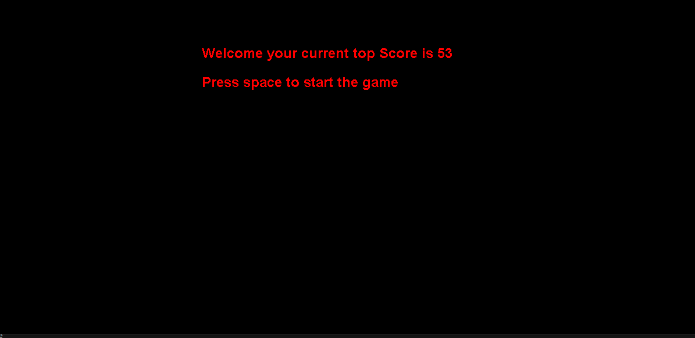

# ⌨️ Typing Speed Game in Java

A fun and fast-paced typing game built with **Java Swing**. Type the moving words before they hit the edge of the screen! Tracks your score, increases speed over time, and saves your best score locally.

---

## 🎮 Features

- Real-time word movement and input tracking
- Per-character accuracy highlighting (green for correct, red for incorrect)
- Random word generation from file
- Saves your top score across sessions (`topScore.txt`)
- Java Swing-based GUI (`JFrame` + custom `JPanel`)
- Simple restart with spacebar

---

## 🖥️ Screenshots

> *(Add your screenshots to a `screenshots/` folder and link them here)*

| Welcome Screen | In-Game |
|----------------|---------|
|  |  |

---

## 🚀 Getting Started

### Prerequisites

- Java JDK 8 or later
- A Java IDE like IntelliJ IDEA, Eclipse, or VS Code
- Basic understanding of Java and Swing

### Installation

1. **Clone the repository:**

```bash
git clone https://github.com/yourusername/typing-speed-game.git
cd typing-speed-game
